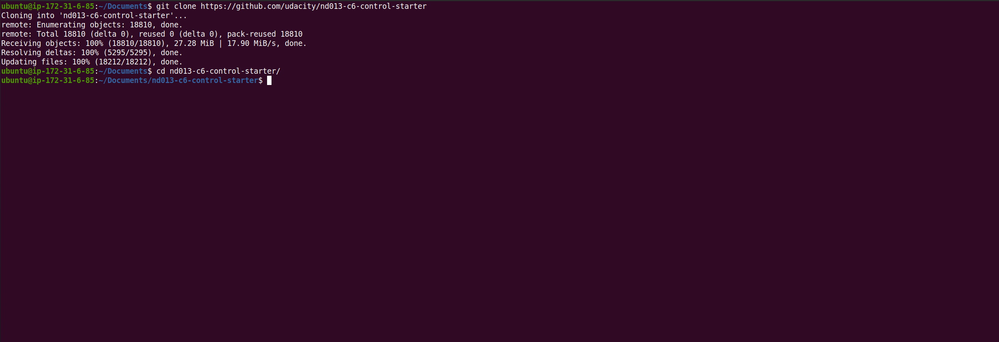
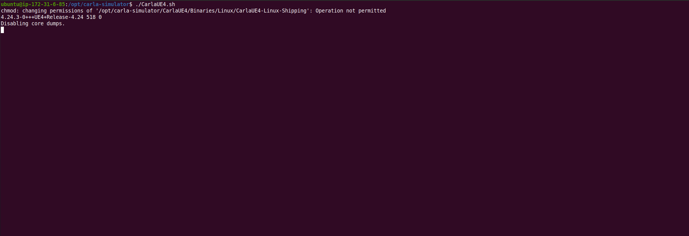
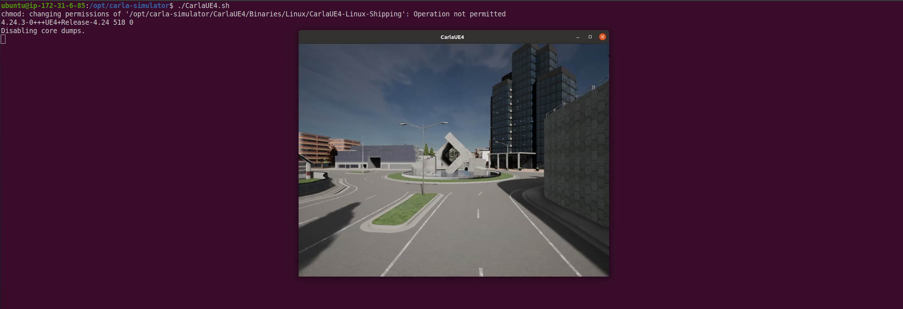
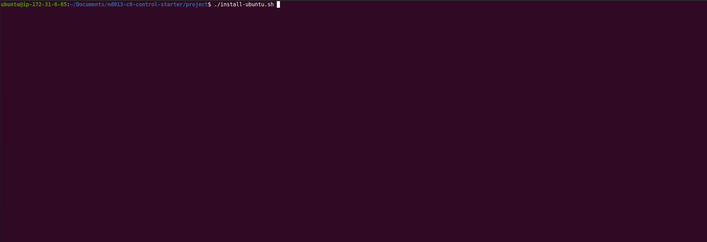
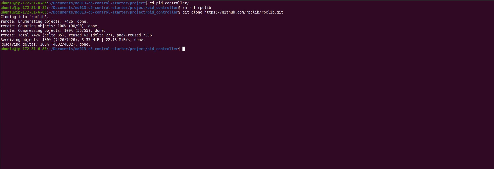
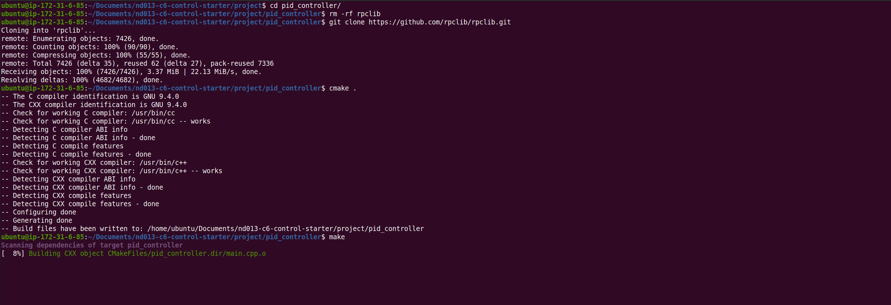
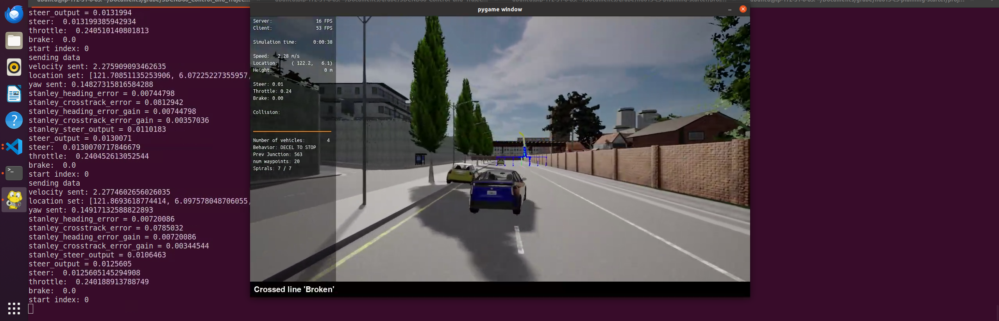

# Project: Control and Trajectory Tracking for Autonomous Vehicle

## Proportional-Integral-Derivative (PID)

In this project, you will apply the skills you have acquired in this course to design a PID controller to perform vehicle trajectory tracking. Given a trajectory as an array of locations, and a simulation environment, you will design and code a PID controller and test its efficiency on the CARLA simulator used in the industry.

## Project Steps Overview

1. Design the PID controller in C++
2. Integrate the controller with the CARLA simulator.
3. Tune the parameters using a technique
4. Explain a strategy to test the controller and perform the test.
5. Create plots to show how successful the controller is as well as the simulator video.
6. Talk about how the controller recovered/etc. Can be a sentence.


## Starter Files

Run the following commands to install the starter code in the Udacity Workspace:

Clone the <a href="https://github.com/udacity/nd013-c6-control-starter" target="_blank">repository</a>:


```bash
git clone https://github.com/udacity/nd013-c6-control-starter.git
cd nd013-c6-control-starter
```



To get started, switch to the project directory

```bash
cd project
```

You should see the project structure as follow:

```bash
.
├── README.md # Must read
├── cserver_dir
├── install-ubuntu.sh
├── manual_control.py
├── pid_controller
├── plot_pid.py
├── run_carla.sh
├── run_main_pid.sh
├── simulatorAPI.py
├── steer_pid_data.txt
└── throttle_pid_data.txt
```

## Installation
 
### For Windows & Ubuntu 18.04 and Earlier
* Pre-requisites:
   * python3.7
   * carla (API)
   * pip 
   * numpy
   * pygame 
   * gtest
   * websocket
* Additional installations:
   * sudo apt install python3.7
   * python3.7 -m pip install -U pip carla pandas matplotlib numpy pygame websocket-client --user
   * sudo apt-get install -y libgoogle-glog-dev libgtest-dev

   
* The deb installation is the easiest way to get the latest release in Linux.
```
sudo apt-key adv --keyserver keyserver.ubuntu.com --recv-keys 1AF1527DE64CB8D9
sudo add-apt-repository "deb [arch=amd64] http://dist.carla.org/carla $(lsb_release -sc) main"
sudo apt-get update # Update the Debian package index
sudo apt-get install carla-simulator=0.9.10-2 
cd /opt/carla-simulator
# Linux
./CarlaUE4.sh
```

More details can be found at [CARLA Quick Start Installation](https://carla.readthedocs.io/en/latest/start_quickstart/)  
> NOTE: CARLA does NOT work on Ubuntu 20.04 or Mac yet!!
  
* Make sure ALL is working well:
   * Open a terminal an launch CARLA (if you don't have it open already):
   ```bash
   cd /opt/carla-simulator
   # Linux
   ./CarlaUE4.sh
   ```

   

   Then, in a few seconds the Carla Simulator will launch:

   

### Install all dependencies

Run the following commands in another terminal window inside the project folder:
```bash
./install-ubuntu.sh
```



Then, compile the `rpclib` library. This library is a msgpack-rpc library written using modern C++. The goal of this library is to provide a simple, no-nonsense RPC solution.
```bash
cd pid_controller
rm -rf rpclib
git clone https://github.com/rpclib/rpclib.git
```



```bash
cmake .
make
```




## Build the project and run the simulator

To test your installation run the following commands.

Run the following commands in the existing terminal window:
```bash
cd pid_controller/
cmake .
make
cd nd013-c6-control-starter/project
./run_main_pid.sh
# This will silently fail 
# ctrl + C to stop 
```



If error bind is already in use, or address already being used

* `ps -aux | grep carla`
* `kill id`


## Project Instructions

In the previous project you built a path planner for the autonomous vehicle. Now you will build the steer and throttle controller so that the car follows the trajectory.

You will design and run the a PID controller as described in the previous course.

In the directory [/pid_controller](https://github.com/udacity/nd013-c6-control-starter/tree/master/project/pid_controller)  you will find the files [pid_controller.cpp](https://github.com/udacity/nd013-c6-control-starter/blob/master/project/pid_controller/pid_controller.cpp)  and [pid_controller.h](https://github.com/udacity/nd013-c6-control-starter/blob/master/project/pid_controller/pid_controller.h). This is where you will code your pid controller.
The function pid is called in [main.cpp](https://github.com/udacity/nd013-c6-control-starter/blob/master/project/pid_controller/main.cpp).

### Step 1: Build the PID controller object
Complete the TODO in the [pid_controller.h](https://github.com/udacity/nd013-c6-control-starter/blob/master/project/pid_controller/pid_controller.h) and [pid_controller.cpp](https://github.com/udacity/nd013-c6-control-starter/blob/master/project/pid_controller/pid_controller.cpp).

Run the simulator and see in the desktop mode the car in the CARLA simulator. Take a screenshot and add it to your report. The car should not move in the simulation.
### Step 2: PID controller for throttle:
1) In [main.cpp](https://github.com/udacity/nd013-c6-control-starter/blob/master/project/pid_controller/main.cpp), complete the TODO (step 2) to compute the error for the throttle pid. The error is the speed difference between the actual speed and the desired speed.

Useful variables:
- The last point of **v_points** vector contains the velocity computed by the path planner.
- **velocity** contains the actual velocity.
- The output of the controller should be inside [-1, 1].

2) Comment your code to explain why did you computed the error this way.

3) Tune the parameters of the pid until you get satisfying results (a perfect trajectory is not expected).

### Step 3: PID controller for steer:
1) In [main.cpp](https://github.com/udacity/nd013-c6-control-starter/blob/master/project/pid_controller/main.cpp), complete the TODO (step 3) to compute the error for the steer pid. The error is the angle difference between the actual steer and the desired steer to reach the planned position.

Useful variables:
- The variable **y_points** and **x_point** gives the desired trajectory planned by the path_planner.
- **yaw** gives the actual rotational angle of the car.
- The output of the controller should be inside [-1.2, 1.2].
- If needed, the position of the car is stored in the variables **x_position**, **y_position** and **z_position**

2) Comment your code to explain why did you computed the error this way.

3) Tune the parameters of the pid until you get satisfying results (a perfect trajectory is not expected).

### Step 4: Evaluate the PID efficiency
The values of the error and the pid command are saved in thottle_data.txt and steer_data.txt.
Plot the saved values using the command (in nd013-c6-control-refresh/project):

```bash
python3 plot_pid.py
```

You might need to install a few additional python modules: 

```bash
pip3 install pandas
pip3 install matplotlib
```

Answer the following questions:
- Add the plots to your report and explain them (describe what you see)
- What is the effect of the PID according to the plots, how each part of the PID affects the control command?
- How would you design a way to automatically tune the PID parameters?
- PID controller is a model free controller, i.e. it does not use a model of the car. Could you explain the pros and cons of this type of controller?
- (Optional) What would you do to improve the PID controller?


### Tips:

- When you wil be testing your c++ code, restart the Carla simulator to remove the former car from the simulation.
- If the simulation freezes on the desktop mode but is still running on the terminal, close the desktop and restart it.
- When you will be tuning the PID parameters, try between those values:


